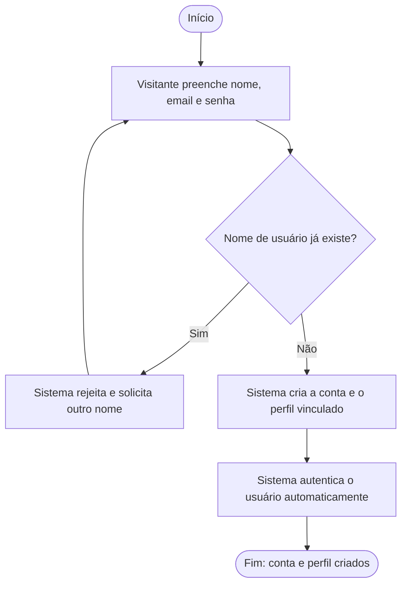

# UC01 — Criar conta

**Ator:** Visitante

```mermaid
flowchart TD
    Start([Início]) --> A[Visitante preenche nome, email e senha]
    A --> B{Nome de usuário já existe?}
    B -- Sim --> C[Sistema rejeita e solicita outro nome]
    C --> A
    B -- Não --> D[Sistema cria a conta e o perfil vinculado]
    D --> E[Sistema autentica o usuário automaticamente]
    E --> End([Fim: conta e perfil criados])
```
