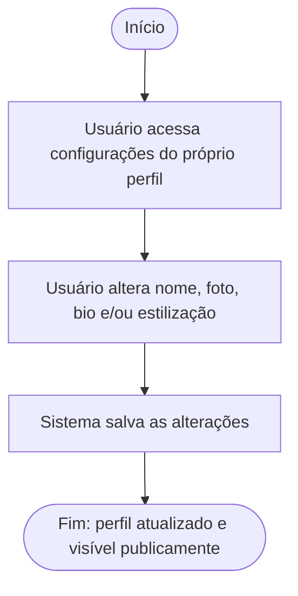

# UC02 — Editar perfil

**Ator:** Usuário (autenticado)

```mermaid
flowchart TD
    Start([Início]) --> A[Usuário acessa configurações do próprio perfil]
    A --> B[Usuário altera nome, foto, bio e/ou estilização]
    B --> C[Sistema salva as alterações]
    C --> End([Fim: perfil atualizado e visível publicamente])
```
