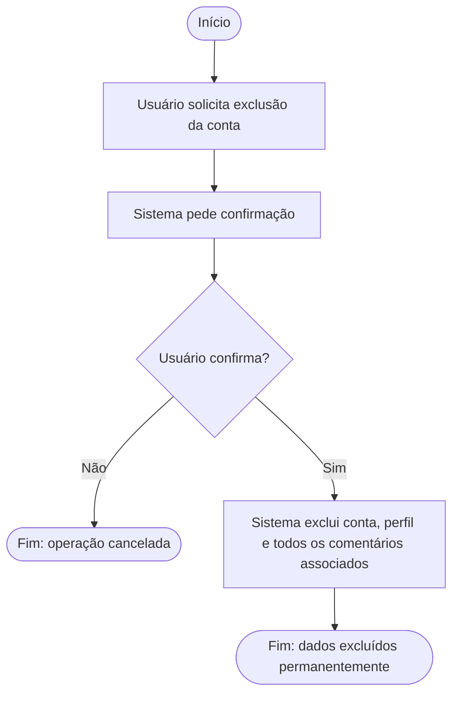

# UC03 — Excluir conta

**Ator:** Usuário (autenticado)

```mermaid
flowchart TD
    Start([Início]) --> A[Usuário solicita exclusão da conta]
    A --> B[Sistema pede confirmação]
    B --> C{Usuário confirma?}
    C -- Não --> End1([Fim: operação cancelada])
    C -- Sim --> D[Sistema exclui conta, perfil e todos os comentários associados]
    D --> End2([Fim: dados excluídos permanentemente])
```
