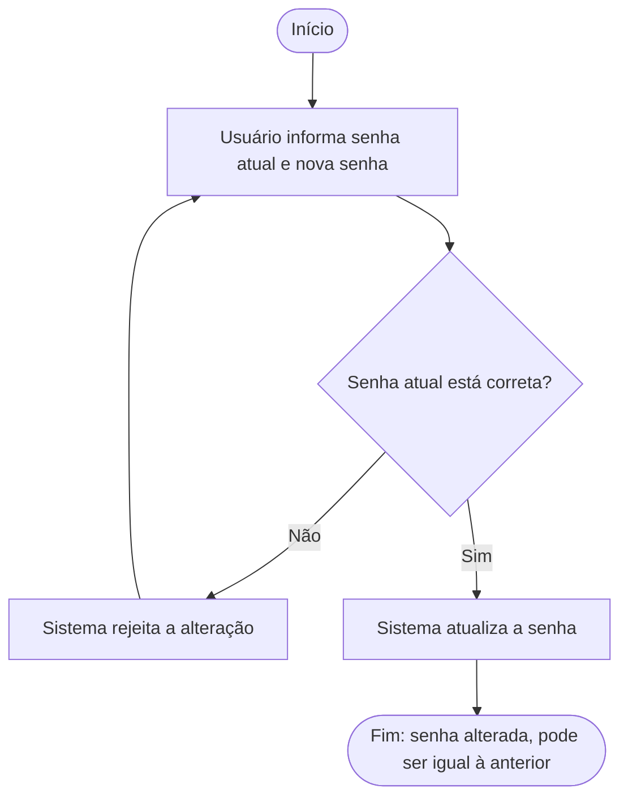

# UC04 — Alterar senha

**Ator:** Usuário (autenticado)

```mermaid
flowchart TD
    Start([Início]) --> A[Usuário informa senha atual e nova senha]
    A --> B{Senha atual está correta?}
    B -- Não --> C[Sistema rejeita a alteração]
    C --> A
    B -- Sim --> D[Sistema atualiza a senha]
    D --> End([Fim: senha alterada, pode ser igual à anterior])
```
