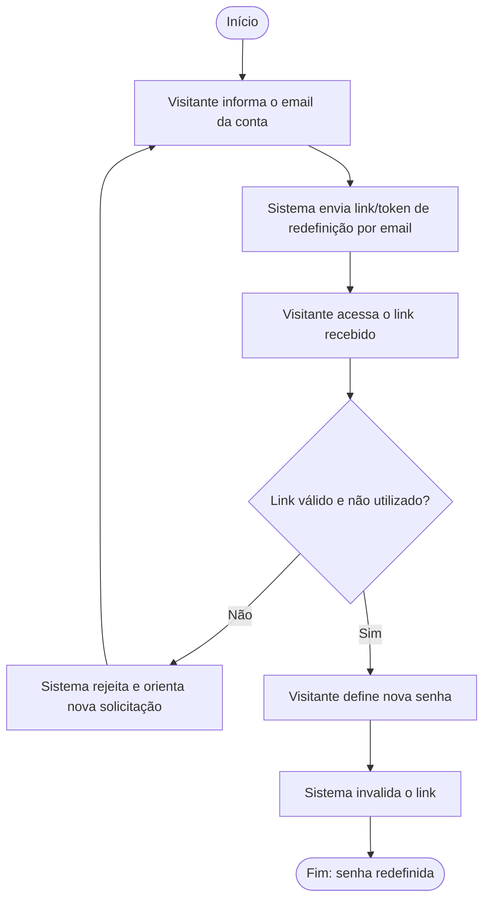

# UC05 — Recuperar senha esquecida

**Ator:** Visitante (dono da conta, não autenticado)

```mermaid
flowchart TD
    Start([Início]) --> A[Visitante informa o email da conta]
    A --> B[Sistema envia link/token de redefinição por email]
    B --> C[Visitante acessa o link recebido]
    C --> D{Link válido e não utilizado?}
    D -- Não --> E[Sistema rejeita e orienta nova solicitação]
    E --> A
    D -- Sim --> F[Visitante define nova senha]
    F --> G[Sistema invalida o link]
    G --> End([Fim: senha redefinida])
```
