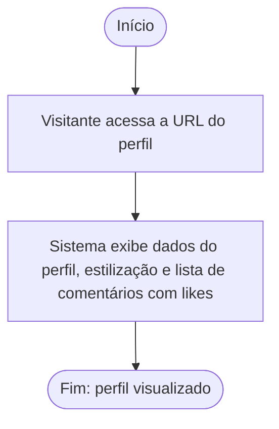

# UC06 — Visualizar perfil e comentários

**Ator:** Visitante

```mermaid
flowchart TD
    Start([Início]) --> A[Visitante acessa a URL do perfil]
    A --> B[Sistema exibe dados do perfil, estilização e lista de comentários com likes]
    B --> End([Fim: perfil visualizado])
```
