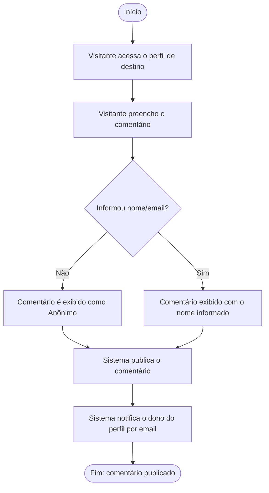

# UC07 — Comentar em perfil

**Ator:** Visitante

```mermaid
flowchart TD
    Start([Início]) --> A[Visitante acessa o perfil de destino]
    A --> B[Visitante preenche o comentário]
    B --> C{Informou nome/email?}
    C -- Não --> D[Comentário é exibido como Anônimo]
    C -- Sim --> E[Comentário exibido com o nome informado]
    D --> F[Sistema publica o comentário]
    E --> F
    F --> G[Sistema notifica o dono do perfil por email]
    G --> End([Fim: comentário publicado])
```
