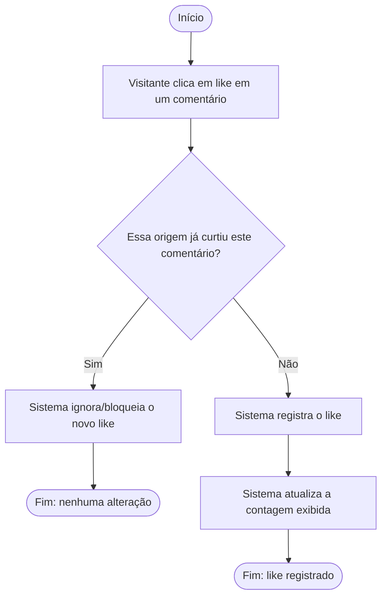

# UC08 — Curtir comentário

**Ator:** Visitante

```mermaid
flowchart TD
    Start([Início]) --> A[Visitante clica em like em um comentário]
    A --> B{Essa origem já curtiu este comentário?}
    B -- Sim --> C[Sistema ignora/bloqueia o novo like]
    C --> End1([Fim: nenhuma alteração])
    B -- Não --> D[Sistema registra o like]
    D --> E[Sistema atualiza a contagem exibida]
    E --> End2([Fim: like registrado])
```
