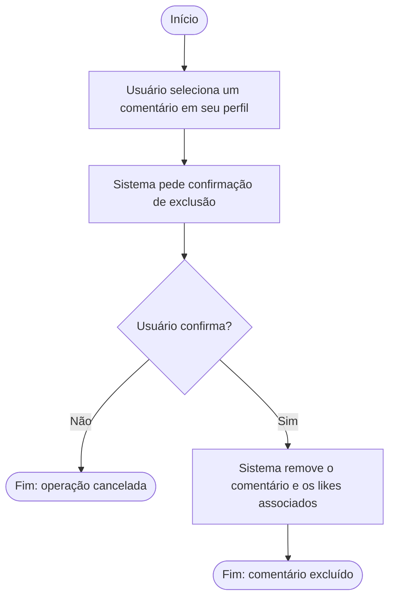

# UC09 — Excluir comentário

**Ator:** Usuário (dono do perfil)

```mermaid
flowchart TD
    Start([Início]) --> A[Usuário seleciona um comentário em seu perfil]
    A --> B[Sistema pede confirmação de exclusão]
    B --> C{Usuário confirma?}
    C -- Não --> End1([Fim: operação cancelada])
    C -- Sim --> D[Sistema remove o comentário e os likes associados]
    D --> End2([Fim: comentário excluído])
```
