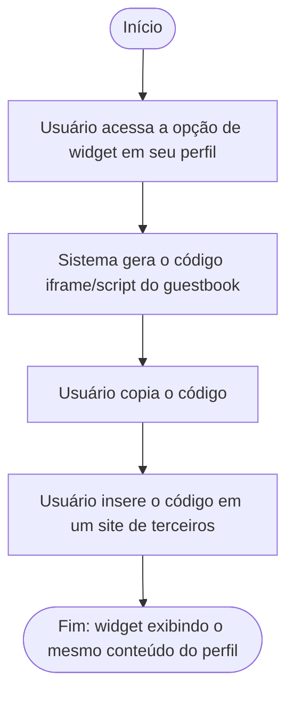

# UC10 — Obter widget embutível

**Ator:** Usuário (autenticado)

```mermaid
flowchart TD
    Start([Início]) --> A[Usuário acessa a opção de widget em seu perfil]
    A --> B[Sistema gera o código iframe/script do guestbook]
    B --> C[Usuário copia o código]
    C --> D[Usuário insere o código em um site de terceiros]
    D --> End([Fim: widget exibindo o mesmo conteúdo do perfil])
```
