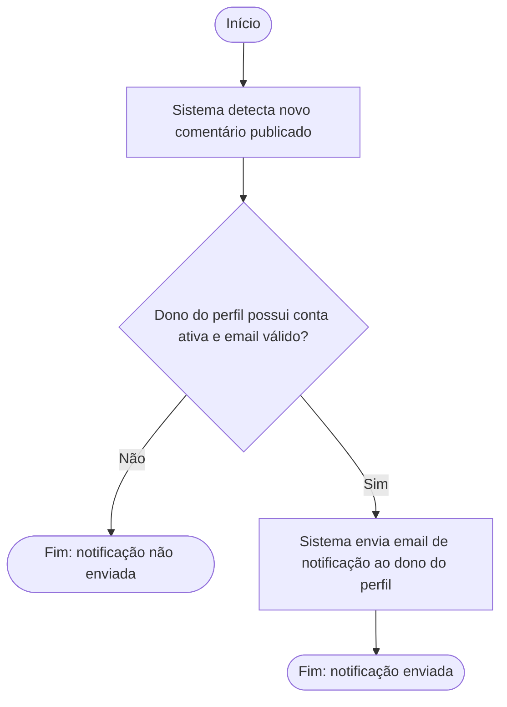

# UC11 — Notificar novo comentário

**Ator:** Sistema

```mermaid
flowchart TD
    Start([Início]) --> A[Sistema detecta novo comentário publicado]
    A --> B{Dono do perfil possui conta ativa e email válido?}
    B -- Não --> End1([Fim: notificação não enviada])
    B -- Sim --> C[Sistema envia email de notificação ao dono do perfil]
    C --> End2([Fim: notificação enviada])
```
