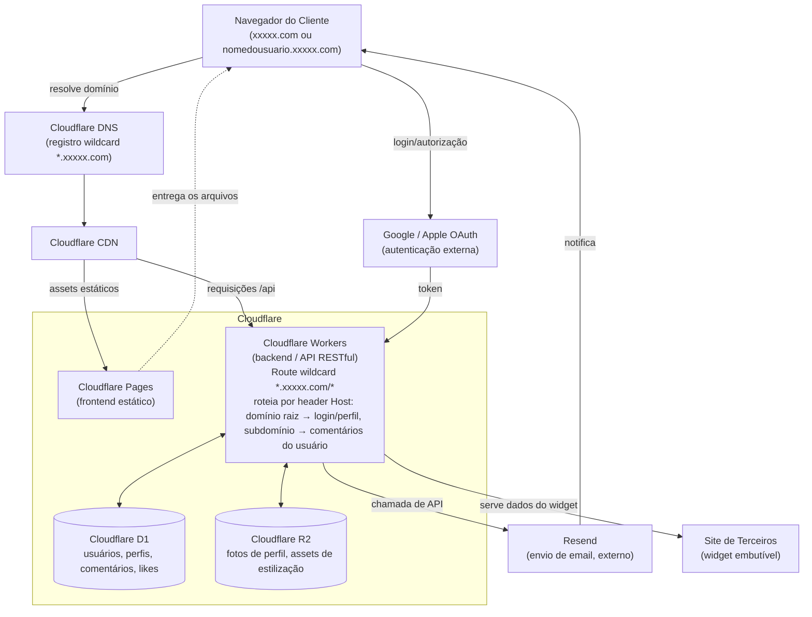

# GuestBook — Diagrama de Blocos (Arquitetura com Cloudflare + Resend)

> Diagrama com os serviços específicos da Cloudflare escolhidos para o projeto, no mesmo nível de detalhe do exemplo com AWS (CloudFront, Cognito, etc.) apresentado em aula.

## Componentes

| Bloco | Serviço | Responsabilidade |
|---|---|---|
| **DNS** | Cloudflare DNS | Resolução do domínio do projeto |
| **CDN** | Cloudflare CDN | Roteamento de borda, cache de assets estáticos |
| **Frontend** | Cloudflare Pages | Hospedagem do frontend, baixado sob demanda no navegador |
| **Backend / API** | Cloudflare Workers | Regras de negócio, autenticação/autorização, orquestra acesso a dados |
| **Banco de Dados** | Cloudflare D1 (SQLite serverless) | Persistência de contas, perfis, comentários e likes |
| **Armazenamento de arquivos** | Cloudflare R2 | Fotos de perfil e assets usados na estilização da página |
| **Autenticação externa** | Google / Apple OAuth | Login via provedor externo — **não existe um serviço equivalente ao Cognito na Cloudflare**, então essa integração é feita diretamente no Worker |
| **Serviço de Email** | Resend (externo, fora da Cloudflare) | Envio de notificações de novo comentário e recuperação de senha, via chamada de API a partir do Worker |
| **Site de Terceiros** | — | Consome o widget embutível, exibindo os comentários do perfil fora do domínio do GuestBook |

## Observações importantes

- Diferente do exemplo com AWS (onde o Cognito centraliza identidade), a Cloudflare **não tem um serviço de identidade gerenciado**. O fluxo OAuth com Google/Apple é implementado no próprio Worker (rotas `/auth/google`, `/auth/google/callback`), que troca o `code` pelo token direto com o provedor e depois cria a sessão do usuário, salva no D1. Esse é o principal ponto onde a arquitetura Cloudflare exige mais código próprio do que a AWS exigiria com o Cognito.
- O envio de email também é externo: o **Cloudflare Email Sending** nativo exige o plano pago (Workers Paid), então o envio de notificações (RF15) é delegado ao **Resend**, chamado via API a partir do Worker. Assim como o OAuth, esse bloco fica fora do subgraph da Cloudflare no diagrama, por ser um serviço de terceiro.
- **Domínio raiz vs. subdomínio do usuário.** `xxxxx.com` concentra login e perfil; `nomedousuario.xxxxx.com` serve os comentários daquele usuário. Isso é resolvido com um registro DNS wildcard (`*.xxxxx.com`) e uma Workers Route wildcard (`*.xxxxx.com/*`), ambos cobertos pelo free tier (o Universal SSL da Cloudflare já inclui certificado wildcard de um nível). O mesmo Worker lê o header `Host` da requisição para decidir qual conteúdo servir. O cookie de sessão precisa ter o domínio configurado como `.xxxxx.com` (com o ponto), para ser válido tanto no domínio raiz quanto em qualquer subdomínio de usuário.
