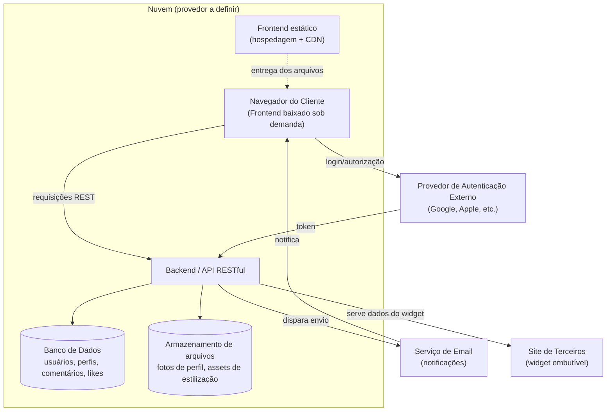

# GuestBook — Diagrama de Blocos (Arquitetura)

> Diagrama agnóstico de provedor de nuvem. A escolha da operadora (Azure, GCP, Oracle Cloud, Render, Railway, etc.) ainda está em aberto — o requisito é apenas ter free tier, já que AWS está descartada.

## Componentes

| Bloco | Responsabilidade |
|---|---|
| **Frontend** | Interface web, baixada sob demanda no navegador do cliente |
| **Backend / API RESTful** | Regras de negócio, autenticação/autorização, orquestra acesso a dados |
| **Banco de Dados** | Persistência de contas, perfis, comentários e likes |
| **Armazenamento de arquivos** | Fotos de perfil e assets usados na estilização da página |
| **Provedor de Autenticação Externo** | Login via OAuth (Google, Apple, etc.) — nenhuma senha de terceiro é gerenciada diretamente |
| **Serviço de Email** | Envio de notificações de novo comentário e recuperação de senha |
| **Site de Terceiros** | Consome o widget embutível, exibindo os comentários do perfil fora do domínio do GuestBook |

